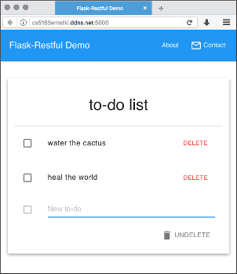

# Flask-Restful + Vue To-do

A simple to-do list using Flask-Restful, Vue.js and MUI (a small CSS + JS
framework implementing Google's Material Design guidelines).



## Author

Kevin Ernst (ernstki -at- mail.uc.edu)

## Installation and Use

```bash
# where <githost> is either github.com or github.uc.edu
git clone git@<githost>:ernstki/flask-restful-todo.git
cd flask-restful-todo

# Install dependencies
pip install -r requirements.txt
bower install

# Run the Flask web application
export FLASK_APP=api.py
flask run
```

If it doesn't already exist, a SQLite database is created for you before the
first request to the web application.

Finally, point your browser at <http://127.0.0.1:5000>, or browse the API at
<http://127.0.0.1:5000/todos>.

## License

Based in part on the Twilio Flask-Restful Quickstart and distributed under the
same terms ([BSD 3-clause](LICENSE.txt)).

## References

1. [Flask-Restful Quickstart][frqs]
2. [Build an App with Vue.js][scotchio] - scotch.io
3. [Vue Guide][vueguide] (mostly the [List Rendering][vuelists] section)

## See also

* Flask documentation on [accessing request data][flask]
* Flask-Restful documentation on [request parsing][fr]
* [MUI][] "Landing Page" sample layout
* [Material Design Lite][mdl] - better display of Material icons in `<li>`s
* [Material Design icons][mdicons]
* [Vue][] (v2.x)
* [Fetchival][] - a friendlier wrapper around [fetch][] for retrieving external
  resources

[flask]: http://flask.pocoo.org/docs/0.12/quickstart/#accessing-request-data
[fr]: https://flask-restful.readthedocs.io/en/0.3.5/reqparse.html
[mui]: https://www.muicss.com/docs/v1/example-layouts/landing-page
[mdl]: https://getmdl.io/started/index.html
[mdicons]: https://material.io/icons
[vue]: https://vuejs.org/
[vueguide]: https://vuejs.org/v2/guide/
[vuelists]: https://vuejs.org/v2/guide/list.html
[fetchival]: https://github.com/typicode/fetchival
[fetch]: https://github.com/github/fetch
[frqs]: https://flask-restful.readthedocs.io/en/latest/quickstart.html
[scotchio]: https://scotch.io/tutorials/build-an-app-with-vue-js-a-lightweight-alternative-to-angularjs
